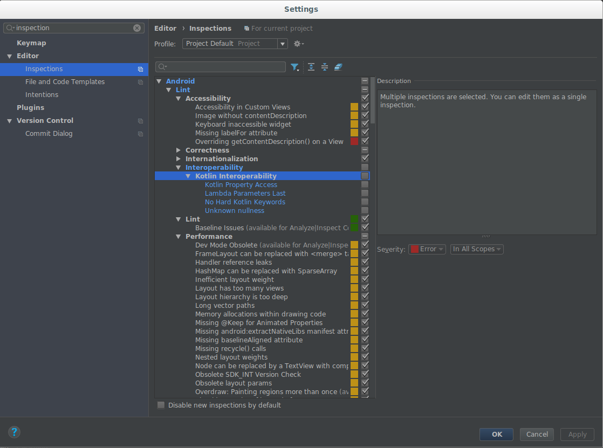

# Kotlin-Java 互操作指南

本文档提供了关于用 Java 和 Kotlin 编写公共 API 的一系列规则，目的是让您从另一种语言使用代码时感觉其符合语言习惯。

[上次更新日期：2018 年 5 月 18 日](https://developer.android.google.cn/kotlin/guides-changelog)

## Java（供 Kotlin 使用）

### 不得使用硬关键字

请勿将 Kotlin 的任何[硬关键字](https://kotlinlang.org/docs/reference/keyword-reference.html#hard-keywords)用作方法或字段的名称。从 Kotlin 调用时，这些硬关键字需要使用反引号进行转义。允许使用[软关键字](https://kotlinlang.org/docs/reference/keyword-reference.html#soft-keywords)、[修饰符关键字](https://kotlinlang.org/docs/reference/keyword-reference.html#modifier-keywords)和[特殊标识符](https://kotlinlang.org/docs/reference/keyword-reference.html#special-identifiers)。

例如，从 Kotlin 使用时，Mockito 的 `when` 函数需要使用反引号：

```kotlin
val callable = Mockito.mock(Callable::class.java)
Mockito.`when`(callable.call()).thenReturn(/* … */)
```

### 避免使用 `Any` 的扩展函数或属性的名称

除非绝对必要，否则应避免对方法使用 [`Any` 的扩展函数](https://kotlinlang.org/api/latest/jvm/stdlib/kotlin/-any/index.html#extension-functions)的名称或对字段使用 [`Any` 的扩展属性](https://kotlinlang.org/api/latest/jvm/stdlib/kotlin/-any/index.html#extension-properties)的名称。虽然成员方法和字段始终优先于 `Any` 的扩展函数或属性，但读取代码时可能很难知道调用的是哪个。

### 可为 null 性注释

公共 API 中的每个非基元参数类型、返回类型和字段类型都应具有可为 null 性注释。不带注释的类型会被解释为[“平台”类型](https://kotlinlang.org/docs/reference/java-interop.html#null-safety-and-platform-types)，而后者的可为 null 性不明确。

JSR 305 软件包注释可用于设置合理的默认值，但目前不建议这样做。这类注释要求编译器遵循一个选择启用标志，而这与 Java 9 的模块系统存在冲突。

### Lambda 参数位于最后

符合 [SAM 转换](https://kotlinlang.org/docs/reference/java-interop.html#sam-conversions)条件的参数类型应位于最后。

例如，`RxJava 2’s Flowable.create()` 方法签名定义为：

```java
public static  Flowable create(
    FlowableOnSubscribe source,
    BackpressureStrategy mode) { /* … */ }
```

由于 FlowableOnSubscribe 符合 SAM 转换条件，因此从 Kotlin 对此方法进行的函数调用如下所示：

```kotlin
Flowable.create({ /* … */ }, BackpressureStrategy.LATEST)
```

不过，如果该方法签名中的参数颠倒顺序，则函数调用可以使用尾随 lambda 语法：

```kotlin
Flowable.create(BackpressureStrategy.LATEST) { /* … */ }
```

### 属性前缀

要使方法在 Kotlin 中表示为属性，必须使用严格的“bean”样式的前缀。

访问器方法需要“get”前缀，而对于布尔值返回方法，可以使用“is”前缀。

```kotlin
public final class User {
  public String getName() { /* … */ }
  public boolean isActive() { /* … */ }
}
val name = user.name // Invokes user.getName()
val active = user.active // Invokes user.isActive()
```

关联的更改器方法需要“set”前缀。

```kotlin
public final class User {
  public String getName() { /* … */ }
  public void setName(String name) { /* … */ }
}
user.name = "Bob" // Invokes user.setName(String)
```

如果要将方法作为属性提供，请勿使用“has”/“set”之类的非标准前缀或不带“get”前缀的访问器。带有非标准前缀的方法仍可作为函数进行调用，这种情况或许可以接受，具体取决于方法的行为。

### 运算符过载

请注意在 Kotlin 中允许使用特殊调用点语法（即[运算符过载](https://kotlinlang.org/docs/reference/operator-overloading.html)）的方法名称。确保这样的方法名称可以有效地与缩短的语法一起使用。

```kotlin
public final class IntBox {
  private final int value;
  public IntBox(int value) {
    this.value = value;
  }
  public IntBox plus(IntBox other) {
    return new IntBox(value + other.value);
  }
}
val one = IntBox(1)
val two = IntBox(2)
val three = one + two // Invokes one.plus(two)
```

## Kotlin（供 Java 使用）

### 文件名

当文件包含顶级函数或属性时，应始终使用 `@file:JvmName("Foo")` 对其进行注释，以提供一个合适的名称。

默认情况下，MyClass.kt 文件中的顶级成员最终会进入一个名为 `MyClassKt` 的类中，此名称没有吸引力，并且会泄露作为实现细节的语言。

不妨考虑添加 `@file:JvmMultifileClass`，以将多个文件中的顶级成员组合到一个类中。

### Lambda 参数

需要从 Java 中使用的[函数类型](https://kotlinlang.org/docs/reference/lambdas.html#function-types)应避免返回类型 `Unit`。这样做要求指定明确的 `return Unit.INSTANCE;` 语句，但该语句不符合语言习惯。

```kotlin
fun sayHi(callback: (String) -> Unit) = /* … */
// Kotlin caller:
greeter.sayHi { Log.d("Greeting", "Hello, $it!") }
// Java caller:
greeter.sayHi(name -> {
    Log.d("Greeting", "Hello, " + name + "!");
    return Unit.INSTANCE;
});
```

此语法也不允许提供从语义上命名的类型以便在其他类型上实现。

在 Kotlin 中为 lambda 类型定义命名的单一抽象方法 (SAM) 接口可以为 Java 更正此问题，但这样就无法在 Kotlin 中使用 lambda 语法。

```kotlin
interface GreeterCallback {
    fun greetName(name: String): Unit
}

fun sayHi(callback: GreeterCallback) = /* … */
// Kotlin caller:
greeter.sayHi(object : GreeterCallback {
    override fun greetName(name: String) {
        Log.d("Greeting", "Hello, $name!")
    }
})
// Java caller:
greeter.sayHi(name -> Log.d("Greeting", "Hello, " + name + "!"))
```

在 Java 中定义命名的 SAM 接口就可以使用稍低版本的 Kotlin lambda 语法，其中必须明确指定接口类型。

```java
// Defined in Java:
interface GreeterCallback {
    void greetName(String name);
}
fun sayHi(greeter: GreeterCallback) = /* … */
// Kotlin caller:
greeter.sayHi(GreeterCallback { Log.d("Greeting", "Hello, $it!") })
// Java caller:
greeter.sayHi(name -> Log.d("Greeter", "Hello, " + name + "!"));
```

要定义一个在 Java 和 Kotlin 中用作 lambda 的参数类型，又要求在这两种语言中使用时都感觉其符合语言习惯，这在目前还无法做到。当前的建议是优先选用函数类型，虽然当返回类型为 `Unit` 时在 Java 中的体验会受到影响。

**注意**：此建议将来可能会改变。请参阅 [KT-7770](https://youtrack.jetbrains.com/issue/KT-7770) 和 [KT-21018](https://youtrack.jetbrains.com/issue/KT-21018)。

### 避免使用 `Nothing` 类属

类属参数为 `Nothing` 的类型会作为原始类型提供给 Java。原始类型在 Java 中很少使用，应避免使用。

### 记录异常

会抛出受检异常的函数应使用 `@Throws` 记录这些异常。运行时异常应记录在 KDoc 中。

请注意函数委托给的 API，因为它们可能会抛出 Kotlin 本来会以静默方式允许传播的受检异常。

### 防御性复制

从公共 API 返回共享或无主的只读集合时，应将其封装在不可修改的容器中或执行防御性复制。虽然 Kotlin 强制要求它们具备只读属性，但在 Java 端没有这样的强制性要求。如果没有封装容器或不执行防御性复制，可能会因返回长期存在的集合引用而违反不变量。

### 伴生函数

**伴生对象**中的公共函数必须带有 `@JvmStatic` 注释才能作为静态方法公开。

如果没有该注释，则这些函数只能作为静态 `Companion` 字段中的实例方法使用。

不正确：没有注释

```kotlin
class KotlinClass {
    companion object {
        fun doWork() {
            /* … */
        }
    }
}
public final class JavaClass {
    public static void main(String... args) {
        KotlinClass.Companion.doWork();
    }
}
```

正确：`@JvmStatic` 注释

```kotlin
class KotlinClass {
    companion object {
        @JvmStatic fun doWork() {
            /* … */
        }
    }
}
public final class JavaClass {
    public static void main(String... args) {
        KotlinClass.doWork();
    }
}
```

### 伴生常量

在 `companion object` 中作为有效常量的公共非 `const` 属性必须带有 `@JvmField` 注释才能作为静态字段公开。

如果没有该注释，则这些属性只能作为静态 `Companion` 字段中命名奇怪的“getter”实例使用。使用 `@JvmStatic` 而不是 `@JvmField` 可将命名奇怪的“getter”移至类的静态方法，但这样仍然不正确。

不正确：没有注释

```kotlin
class KotlinClass {
    companion object {
        const val INTEGER_ONE = 1
        val BIG_INTEGER_ONE = BigInteger.ONE
    }
}
public final class JavaClass {
    public static void main(String... args) {
        System.out.println(KotlinClass.INTEGER_ONE);
        System.out.println(KotlinClass.Companion.getBIG_INTEGER_ONE());
    }
}
```

不正确：`@JvmStatic` 注释

```kotlin
class KotlinClass {
    companion object {
        const val INTEGER_ONE = 1
        @JvmStatic val BIG_INTEGER_ONE = BigInteger.ONE
    }
}
public final class JavaClass {
    public static void main(String... args) {
        System.out.println(KotlinClass.INTEGER_ONE);
        System.out.println(KotlinClass.getBIG_INTEGER_ONE());
    }
}
```

正确：`@JvmField` 注释

```kotlin
class KotlinClass {
    companion object {
        const val INTEGER_ONE = 1
        @JvmField val BIG_INTEGER_ONE = BigInteger.ONE
    }
}
public final class JavaClass {
    public static void main(String... args) {
        System.out.println(KotlinClass.INTEGER_ONE);
        System.out.println(KotlinClass.BIG_INTEGER_ONE);
    }
}
```

### 符合语言习惯的命名

Kotlin 的调用规范与 Java 不同，这可能会改变您为函数命名的方式。请使用 `@JvmName` 设计名称，使其符合这两种语言的规范或与各自的标准库命名保持一致。

扩展函数和扩展属性最常出现这种情况，因为接收器类型的位置不同。

```kotlin
sealed class Optional
data class Some(val value: T): Optional()
object None : Optional()

@JvmName("ofNullable")
fun  T?.asOptional() = if (this == null) None else Some(this)
// FROM KOTLIN:
fun main(vararg args: String) {
    val nullableString: String? = "foo"
    val optionalString = nullableString.asOptional()
}
// FROM JAVA:
public static void main(String... args) {
    String nullableString = "Foo";
    Optional optionalString =
          Optionals.ofNullable(nullableString);
}
```

### 默认值的函数过载

参数具有默认值的函数必须使用 `@JvmOverloads`。如果没有此注释，则无法使用任何默认值来调用函数。

使用 `@JvmOverloads` 时，应检查生成的方法，以确保它们每个都有意义。如果它们没有意义，请执行以下一种或两种重构，直到满意为止：

- 更改参数顺序，使具有默认值的参数尽量接近末尾。
- 将默认值移至手动函数过载。

不正确：没有 `@JvmOverloads`

```kotlin
class Greeting {
    fun sayHello(prefix: String = "Mr.", name: String) {
        println("Hello, $prefix $name")
    }
}
public class JavaClass {
    public static void main(String... args) {
        Greeting greeting = new Greeting();
        greeting.sayHello("Mr.", "Bob");
    }
}
```

正确：`@JvmOverloads` 注释

```kotlin
class Greeting {
    @JvmOverloads
    fun sayHello(prefix: String = "Mr.", name: String) {
        println("Hello, $prefix $name")
    }
}
public class JavaClass {
    public static void main(String... args) {
        Greeting greeting = new Greeting();
        greeting.sayHello("Bob");
    }
}
```

## Lint 检查

### 要求

- **Android Studio 版本**：3.2 Canary 10 或更高版本
- **Android Gradle 插件版本**：3.2 或更高版本

### 支持的检查

现在有一些 Android Lint 检查可帮助您检测并标记上述某些互操作性问题。目前只检测到了 Java（供 Kotlin 使用）中的问题。具体来说，支持的检查包括：

- 未知 Null 性
- 属性访问
- 不得使用 Kotlin 硬关键字
- Lambda 参数位于最后

### Android Studio

要启用这些检查，请依次转到 **File > Preferences > Editor > Inspections**，然后在“Kotlin Interoperability”下勾选要启用的规则：




**图 1.**Android Studio 中的 Kotlin 互操作性设置。

勾选要启用的规则后，当您运行代码检查（依次转到 **Analyze > Inspect Code…**）时，将运行新的检查。

### 命令行 build

要通过命令行 build 启用这些检查，请在 `build.gradle` 文件中添加以下代码行：

```groovy
android {

    ...

    lintOptions {
        enable 'Interoperability'
    }
}
```

如需了解 lintOptions 内支持的全部配置，请参阅 Android [Gradle DSL 参考](https://google.github.io/android-gradle-dsl/current/com.android.build.gradle.internal.dsl.LintOptions.html)。

然后，从命令行运行 `./gradlew lint`。